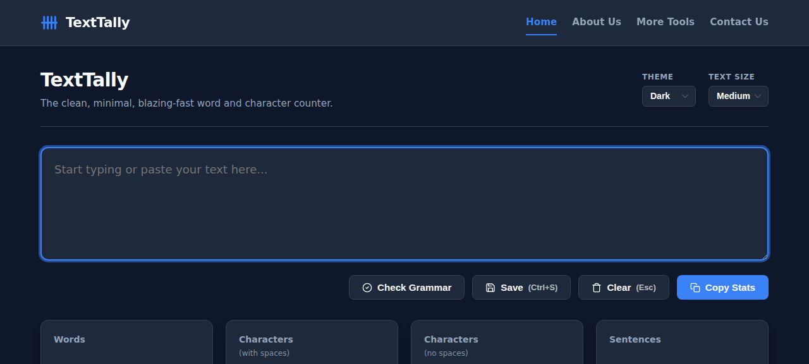

# TextTally Word Counter

A blazing-fast, minimal, offline-first word and character counter designed for writers, students, social media managers, and editors. TextTally provides instant text statistics with zero clutter, zero frameworks, and zero external dependencies at runtime.



## Features

- **Real-Time Statistics**: Instantly calculates words, characters (with and without spaces), sentences, paragraphs, reading time, and speaking time as you type.
- **Privacy-First Promise**: All calculations, text processing, and grammar checks are performed locally in your browser. Your text never leaves your device.
- **Multiple Color Themes**: Choose from Light, Dark, Sepia (warm paper tones), Forest, or Ocean themes to protect your eyes during long writing sessions.
- **Interactive Grammar & Spell Checker**: Checks for spelling, duplicate spaces, capitalization, and grammar using rule-based local analysis and LanguageTool's secure API. Double click or click "Fix" to automatically correct suggestions.
- **Font Size Customization**: Adjustable textarea font size options (Small, Medium, Large) to suit your preference.
- **Manual Save & txt Export**: Save your drafts to Secure LocalStorage and instantly download them as `.txt` files. Support for `Ctrl+S` keyboard shortcuts.
- **Responsive Navigation**: Access secondary pages (Home, About Us, More Tools, Contact Us) across all screen configurations.

## Architecture

TextTally is built to be as minimal and lightweight as possible:
- **Zero Frameworks**: Written in standard, robust Vanilla ES6+ JavaScript.
- **Single CSS Codebase**: A single `style.css` styles the entire multi-page application.
- **Zero-Dependency**: No external fonts, analytics trackers, or render-blocking scripts are loaded.

## How to Run Locally

You can run TextTally locally by double-clicking `index.html` in your browser, or serving it through any lightweight static file server:

### Using Bun (Recommended)
We have provided a native `server.ts` powered by Bun for serving the site:
```bash
bun run server.ts
```

This will run a lightning-fast web server serving TextTally on port `3000`.

---
*Developed with care by TextTally Team.*
